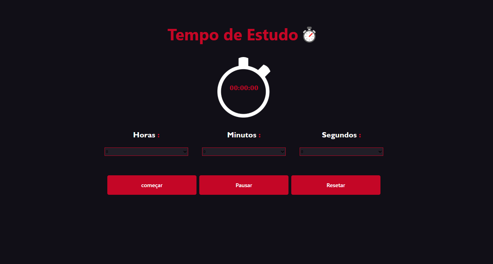

# ⏱️ Cronômetro Web

Este é um projeto de cronômetro desenvolvido com HTML, CSS e JavaScript.

Criei este cronômetro com o objetivo de me ajudar nos meus estudos, marcando o tempo de estudo com foco e disciplina. É uma ferramenta simples, mas muito útil para manter a produtividade!

## 🔧 Funcionalidades
- Definir horas, minutos e segundos
- Botão de **Iniciar**
- Botão de **Pausar**
- Botão de **Resetar**
- Alerta sonoro ao fim do tempo
- Validação para impedir início com tempo zerado

## 💻 Interface

> A imagem acima mostra o layout da aplicação com os botões e o tempo correndo.

## 🚀 Como usar
1. Escolha horas, minutos ou segundos.
2. Clique em **Começar**.
3. Pause, resete ou deixe o tempo acabar!

---

### 👨‍💻 Tecnologias usadas
- HTML5
- CSS3
- JavaScript Puro

---
